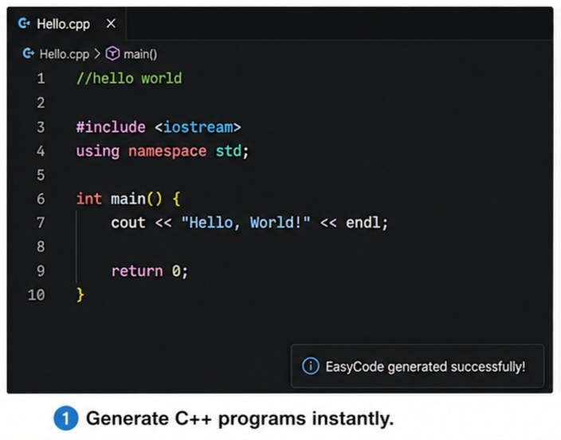
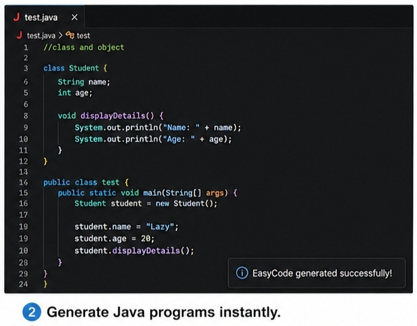
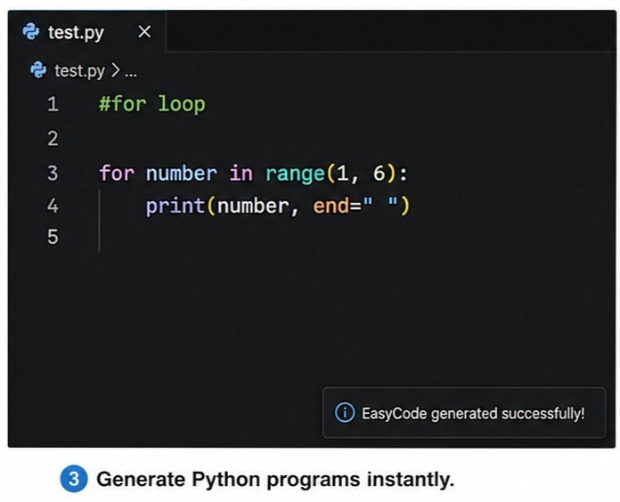
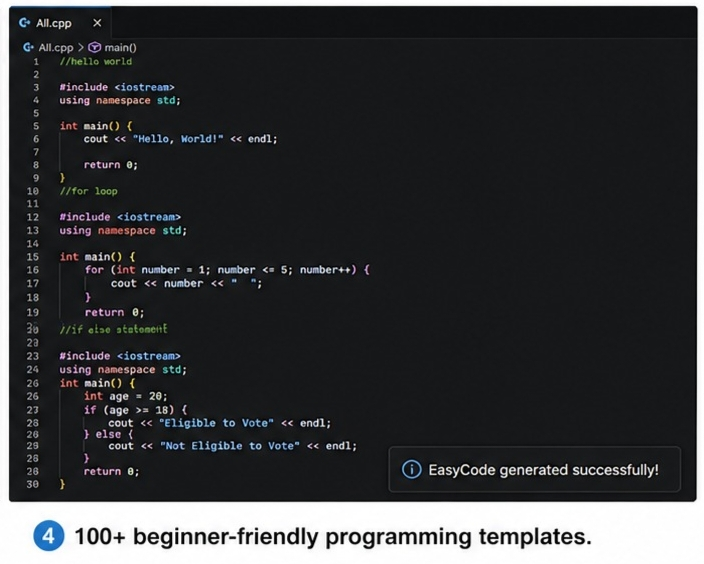

# EasyCode Dev

Generate beginner-friendly C++, Java, and Python programs instantly inside VS Code.

## Features

* C++ Templates
* Java Templates
* Python Templates
* Input and Non-Input Programs
* Beginner-Friendly Examples
* One-Click Code Generation

```md
- Generate programs instantly with Ctrl + Enter

## C++ Example

```cpp
//hello world
```



## Java Example

```java
//class and object
```



## Python Example

```python
#for loop
```



## Multiple Templates



## Supported Languages

* C++
* Java
* Python

## How to Use

### C++

```cpp
//hello world
```

### Java

```java
//class and object
```

### Python

```python
#for loop
```

Place the cursor on the command line and press:

```text
Ctrl + Enter
```

```text
EasyCode Dev: Generate Program
```
EasyCode Dev will automatically generate the corresponding program below the command.

## Requirements

* Visual Studio Code
* C++, Java, or Python file

## Enjoy Coding with EasyCode Dev!